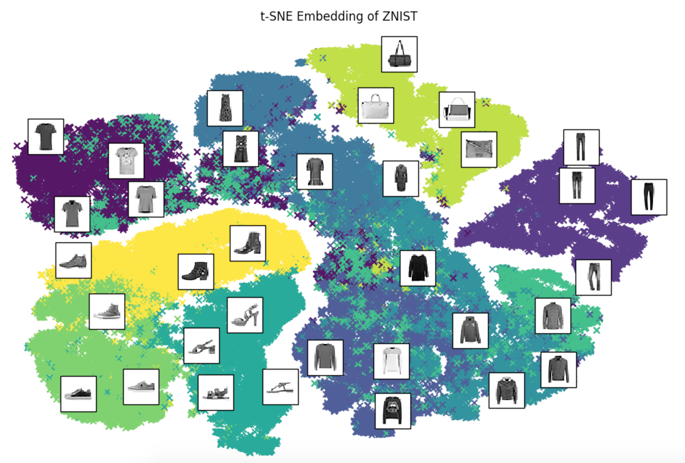
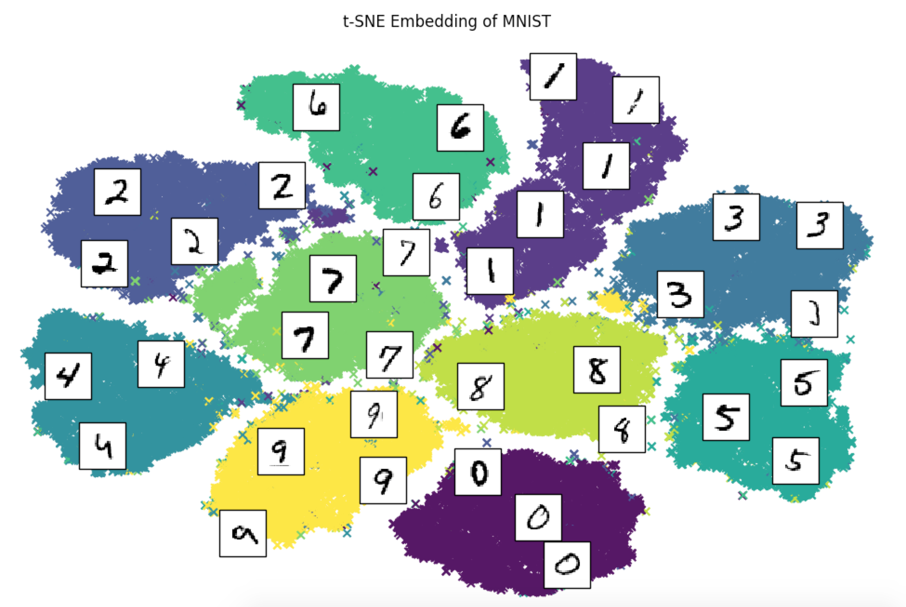

# znist-playground

Playground for experimenting with neural nets and deep learning using Tensorflow.

## Contents

* Training ConvNets
* Saving and restoring models 
* ConvNets as Feature Extractors
* SVM classification using extracted features
* Projecting embeddings using Tensorboard
* Dimensionality Reduction via PCA and t-SNE
* kNN classification using embedded feature space 

## Data 

* [ZNIST](https://github.com/zalandoresearch/fashion-mnist): dataset of Zalando's fashion article images in MNIST format

* [MNIST](http://yann.lecun.com/exdb/mnist/): dataset of handwritten images following a standardized format

* Download and extract datasets by running `make data`

## Figures

--------

<small>Project based on the <a target="_blank" href="https://drivendata.github.io/cookiecutter-data-science/">cookiecutter data science project template</a>. #cookiecutterdatascience</small>
